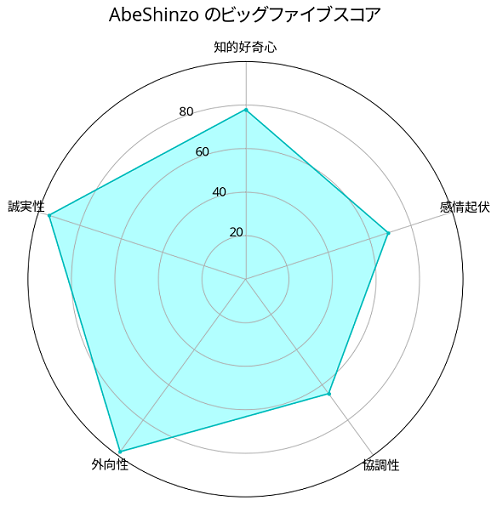

IBM Watson Personality Insight
====

IBM Watson Developer Cloudで公開されている[Personality Insights](https://www.ibm.com/watson/jp-ja/developercloud/personality-insights.html)を使用するためのスクリプトです。  

## Description
TwitterIDや性格分析したい人による執筆記事（ブログ等）を入力することによって、当該ユーザのビッグファイブ（性格特性）を推定できます。  
推定したビッグファイブは視覚的に分かりやすいレーダーチャートで描画されます。

Personality Insightsの使用、及びTwitterのツイート取得にはAPIを用いていますので、ご自身のAPI KEYを用意して下さい。

## Demo
Twitter上のユーザである `@AbeShinzo` の性格を分析した結果は以下のようになります。

## Requirement
- Python3 or more

## Usage
#### Twitterユーザの性格を推定したい場合
`python3 twitter_personal.py hogehoge`  
で @hogehoge の性格を分析できます。

#### ブログ記事等RAWデータから性格を推定したい場合
`Python3 text_personal.py InputText/test.txt`  
で test.txt を執筆したユーザの性格を分析できます。

ブログ等の記事を適宜コピペして .txt ファイルを作成して下さい。

## Author

[nekunet](https://github.com/nekunet)
